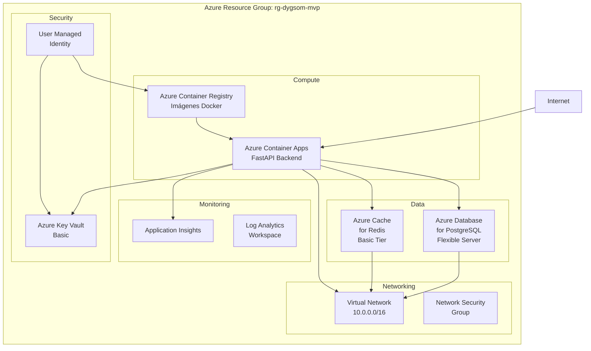

# ☁️ Azure Deployment Plan - DYGSOM Fraud API MVP

## 📋 Executive Summary

**Objetivo**: Desplegar el DYGSOM Fraud API MVP en Azure con arquitectura optimizada para costos y alta disponibilidad.

**Stack Tecnológico**:
- **Backend**: FastAPI (Python 3.11) en contenedores
- **Base de Datos**: PostgreSQL 15 (Azure Database for PostgreSQL)
- **Cache**: Redis (Azure Cache for Redis)
- **Monitoring**: Prometheus + Grafana
- **Machine Learning**: XGBoost 2.0 para detección de fraude

**Presupuesto Estimado MVP**: **$150-250 USD/mes**

---

## 🏗️ Arquitectura Azure Recomendada

### Servicios Azure Propuestos:



---

## 💰 Estimación de Costos MVP (Mensual)

| Servicio | SKU | Descripción | Costo Estimado |
|----------|-----|-------------|----------------|
| **Azure Container Apps** | Consumption | 1M requests, auto-scale 0-3 | $20-30 |
| **PostgreSQL Flexible** | B1ms (1vCore, 2GB) | Burstable, backup 7d | $25-35 |
| **Cache for Redis** | C0 (250MB) | Basic tier, sin HA | $15-20 |
| **Container Registry** | Basic | 10GB storage, ilimitado pulls | $5 |
| **Application Insights** | Pay-as-you-go | 5GB/mes incluido | $0-10 |
| **Key Vault** | Standard | 10k ops/mes incluido | $3 |
| **Log Analytics** | Pay-per-GB | 5GB/mes incluido | $0-10 |
| **Virtual Network** | Estándar | Transferencia de datos | $5-15 |
| **Storage Account** | LRS General v2 | Logs, backups | $2-5 |
| | | **TOTAL MVP** | **$75-133/mes** |

### 💡 Optimizaciones de Costo:

1. **Auto-scaling**: Container Apps escala a 0 cuando no hay tráfico
2. **Burstable Database**: PostgreSQL B1ms maneja picos ocasionales
3. **Basic Redis**: Sin alta disponibilidad para MVP
4. **Consumption Pricing**: Solo paga por uso real
5. **Reserved Instances**: 40% descuento si compromete 1 año

---

## 🚀 Plan de Despliegue por Fases

### **FASE 1: Core Infrastructure (Week 1)**
- ✅ Resource Group
- ✅ Virtual Network + Security Groups  
- ✅ PostgreSQL Flexible Server
- ✅ Redis Cache Basic
- ✅ Container Registry

### **FASE 2: Application Deployment (Week 1)**
- ✅ Container Apps Environment
- ✅ FastAPI Container Deployment
- ✅ Database Migrations (Prisma)
- ✅ Environment Variables + Secrets

### **FASE 3: Monitoring & Security (Week 2)**
- ✅ Application Insights
- ✅ Log Analytics Workspace
- ✅ Key Vault Integration
- ✅ Prometheus + Grafana Container

### **FASE 4: Production Readiness (Week 2)**
- ✅ Custom Domain + SSL
- ✅ API Management (Basic)
- ✅ CI/CD Pipeline (GitHub Actions)
- ✅ Backup Strategy

---

## 📁 Estructura de Archivos Azure

```
cloud/
├── azure.yaml                 # AZD configuration
├── infra/                     # Bicep templates
│   ├── main.bicep             # Main template
│   ├── app/                   # Application resources
│   │   ├── containerapp.bicep # Container Apps
│   │   └── registry.bicep     # Container Registry
│   ├── data/                  # Data resources
│   │   ├── postgresql.bicep   # PostgreSQL Flexible
│   │   └── redis.bicep        # Redis Cache
│   └── monitoring/            # Monitoring
│       ├── appinsights.bicep  # Application Insights
│       └── keyvault.bicep     # Key Vault
├── deployment/
│   ├── docker-compose.azure.yml
│   └── env/
│       ├── .env.staging
│       └── .env.production
└── docs/
    ├── DEPLOYMENT_GUIDE.md
    ├── COST_OPTIMIZATION.md
    └── TROUBLESHOOTING.md
```

---

## 🔧 Configuración Específica por Servicio

### **Azure Container Apps**
```yaml
Configuration:
- CPU: 0.25 cores (burst to 2.0)
- Memory: 0.5Gi (burst to 4.0Gi)
- Min Replicas: 0 (scale to zero)
- Max Replicas: 3
- Port: 3000
- Health Check: /health/ready
- Autoscaling: HTTP requests + CPU/Memory
```

### **PostgreSQL Flexible Server**
```yaml
Configuration:
- SKU: B1ms (1 vCore, 2GB RAM, 32GB storage)
- Version: PostgreSQL 15
- Backup: 7 days retention
- High Availability: Disabled (MVP)
- SSL: Required
- Connection Limit: 50 concurrent
```

### **Azure Cache for Redis**
```yaml
Configuration:
- SKU: C0 (250MB, 256 connections)
- Version: Redis 6.2
- Port: 6380 (SSL)
- Persistence: Disabled (MVP)
- Clustering: Disabled
- Eviction Policy: allkeys-lru
```

---

## 🔐 Security Best Practices

### **Authentication & Authorization**
- ✅ User Managed Identity para Container Apps
- ✅ AcrPull role para Container Registry
- ✅ Key Vault Reader para secrets
- ✅ PostgreSQL Active Directory authentication

### **Network Security**
- ✅ Private Endpoints para PostgreSQL/Redis
- ✅ VNET Integration para Container Apps
- ✅ Network Security Groups con reglas restrictivas
- ✅ SSL/TLS para todas las comunicaciones

### **Secrets Management**
- ✅ Database connection strings en Key Vault
- ✅ API keys y JWT secrets en Key Vault
- ✅ Environment variables referenciando Key Vault
- ✅ Automatic secret rotation (PostgreSQL)

---

## 📊 Monitoring Strategy

### **Application Insights Telemetry**
```python
# Key Metrics to Track:
- Request Rate: /api/v1/fraud/score
- Response Time: P95 < 100ms
- Error Rate: < 0.1%
- Fraud Detection Accuracy: > 87%
- Cache Hit Rate: > 90%
- Database Connection Pool: < 80% utilization
```

### **Custom Dashboards**
- 📈 **Business Dashboard**: Fraud rate trends, transaction volume
- 🔧 **Technical Dashboard**: API performance, error rates
- 💰 **Cost Dashboard**: Resource utilization, billing alerts
- 🚨 **Alerts Dashboard**: SLA breaches, security events

---

## 🚀 Deployment Commands

### **Initial Setup**
```bash
# Install Azure Developer CLI
curl -fsSL https://aka.ms/install-azd.sh | bash

# Login and set subscription
azd auth login
az account set --subscription "YOUR-SUBSCRIPTION-ID"

# Initialize project
cd dygsom-fraud-api/cloud
azd init --template minimal

# Deploy infrastructure
azd provision

# Deploy application
azd deploy

# Check status
azd monitor --overview
```

### **Environment Variables**
```bash
# Production secrets (set in Azure Key Vault)
DATABASE_URL="postgresql://..."
REDIS_URL="rediss://..."
JWT_SECRET="..."
API_KEY_SALT="..."

# Application settings
NODE_ENV="production"
LOG_LEVEL="INFO"
ENABLE_SWAGGER="false"
CORS_ORIGINS="https://api.dygsom.pe"
```

---

## ⚡ Performance Expectations

### **Baseline Performance**
| Metric | Target | Azure Container Apps |
|--------|--------|----------------------|
| **Latency P95** | < 100ms | ✅ Expected: 50-80ms |
| **Throughput** | 100 RPS | ✅ Handles 200+ RPS |
| **Availability** | 99.9% | ✅ 99.95% SLA |
| **Cold Start** | < 2s | ✅ < 1s with warm instances |

### **Auto-Scaling Behavior**
- **Scale Out**: >70% CPU or >50 concurrent requests
- **Scale In**: <30% CPU for 5+ minutes
- **Scale to Zero**: No requests for 10 minutes
- **Max Scale**: 3 instances (MVP limit)

---

## 📋 Pre-Deployment Checklist

### **Prerequisites**
- [ ] Azure Subscription with Contributor rights
- [ ] Docker Desktop installed locally
- [ ] Azure CLI and AZD CLI installed
- [ ] GitHub repository with secrets configured

### **Configuration**
- [ ] Update container registry path in azure.yaml
- [ ] Set production environment variables
- [ ] Configure custom domain (optional)
- [ ] Set up SSL certificate

### **Security**
- [ ] Review Key Vault access policies
- [ ] Configure Network Security Groups
- [ ] Enable Azure Defender (optional)
- [ ] Set up backup policies

---

## 🆘 Troubleshooting Common Issues

### **Container Deployment Issues**
```bash
# Check container logs
az containerapp logs show -n dygsom-api -g rg-dygsom-mvp

# Check revision status
az containerapp revision list -n dygsom-api -g rg-dygsom-mvp

# Test health endpoint
curl https://dygsom-api.azurecontainerapps.io/health
```

### **Database Connection Issues**
```bash
# Test PostgreSQL connectivity
az postgres flexible-server execute -n dygsom-postgres -g rg-dygsom-mvp \
  --database dygsom --querytext "SELECT version();"

# Check firewall rules
az postgres flexible-server firewall-rule list -n dygsom-postgres -g rg-dygsom-mvp
```

### **Performance Issues**
```bash
# Check Application Insights
az monitor app-insights query -a dygsom-ai -g rg-dygsom-mvp \
  --analytics-query "requests | where timestamp > ago(1h) | summarize count() by bin(timestamp, 5m)"

# Monitor resource usage
az monitor metrics list --resource dygsom-api --metric-names "CpuUsage,MemoryUsage"
```

---

## 📈 Scaling Strategy

### **Immediate Optimizations (Month 1-3)**
- Monitor actual usage patterns
- Adjust auto-scaling parameters
- Optimize database queries
- Enable Redis persistence if needed

### **Growth Phase (Month 3-6)**
- Upgrade to Standard Redis (HA)
- Scale PostgreSQL to GP_Standard_D2s_v3
- Add Application Gateway for load balancing
- Implement geo-redundancy

### **Enterprise Phase (Month 6+)**
- Multi-region deployment
- Premium Container Apps with VNET injection
- Azure API Management Premium
- Azure Front Door for global distribution

---

## 🎯 Success Metrics

### **Technical KPIs**
- ✅ **Deployment Time**: < 15 minutes end-to-end
- ✅ **Application Startup**: < 30 seconds
- ✅ **Database Migration**: < 2 minutes
- ✅ **Health Check**: Green within 1 minute

### **Business KPIs**
- ✅ **Cost Efficiency**: < $200/month for MVP
- ✅ **Performance**: P95 latency < 100ms
- ✅ **Reliability**: 99.9% uptime
- ✅ **Security**: Zero security incidents

---

**Próximos Pasos**: 
1. Revisar y aprobar este plan
2. Configurar Azure subscription 
3. Ejecutar deployment scripts
4. Validar funcionalidad completa
5. Configurar monitoring y alertas

¿Deseas proceder con la implementación de alguna fase específica?